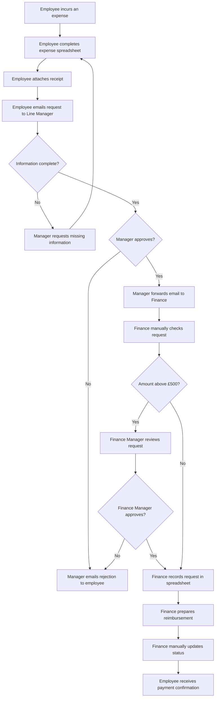

# As-Is Expense Approval Process

## 1. Purpose

This document describes the current manual expense submission and approval process before automation is introduced.

The process is based on a fictional medium-sized organisation where expense requests are managed through email and spreadsheets.

## 2. Process Participants

- Employee
- Line Manager
- Finance Officer
- Finance Manager

## 3. Current Process Flow

## 4. Detailed Process Steps

| Step | Process Activity | Owner | Method | Main Issue |
|---:|---|---|---|---|
| 1 | Employee records expense information | Employee | Spreadsheet | Different file versions may be used |
| 2 | Employee attaches receipt | Employee | Email attachment | Receipt may be missing |
| 3 | Employee sends request | Employee | Email | No automatic validation |
| 4 | Manager checks information | Line Manager | Manual email review | Information may be incomplete |
| 5 | Manager approves or rejects | Line Manager | Email | Approval may be delayed |
| 6 | Approved request is forwarded | Line Manager | Email | Email may be missed |
| 7 | Finance checks the request | Finance Officer | Manual review | Checks may be duplicated |
| 8 | High-value request receives additional review | Finance Manager | Email | No automatic routing |
| 9 | Finance records the request | Finance Officer | Spreadsheet | Manual data-entry errors may occur |
| 10 | Finance prepares reimbursement | Finance Officer | Manual process | Limited status visibility |
| 11 | Finance updates the spreadsheet | Finance Officer | Spreadsheet | Status may not be current |
| 12 | Employee receives confirmation | Finance Officer | Email | Employee cannot independently track progress |

## 5. Current Process Problems

### Manual Data Entry

Finance employees must copy information from emails and attachments into a spreadsheet. This creates additional work and increases the risk of data-entry errors.

### Incomplete Submissions

Employees can send requests without completing all required information or attaching a receipt.

### Approval Delays

Approval requests can remain in an approver's inbox without an automatic reminder or escalation.

### Limited Status Visibility

Employees cannot view the current status of their requests and may need to contact the manager or finance team.

### Inconsistent Approval Routing

Requests are manually forwarded to approvers. High-value requests may not always be escalated consistently.

### Fragmented Audit Trail

Submission details, approval decisions and supporting documents are distributed across emails and spreadsheets.

### Limited Management Reporting

The spreadsheet is maintained manually and may not provide timely information about expenses, outstanding requests or approval performance.

## 6. Existing Controls

The current process includes the following manual controls:

- Receipt review
- Line Manager approval
- Additional approval for high-value expenses
- Finance validation
- Spreadsheet record of processed expenses

However, these controls depend heavily on individuals following the correct process.

## 7. Baseline Measures Required

Because this is a portfolio prototype, actual organisational performance data is not available. In a real project, the Business Analyst would collect the following baseline measures:

- Average time from submission to approval
- Percentage of incomplete submissions
- Percentage of requests returned for correction
- Number of overdue approval requests
- Average finance processing time
- Number of duplicate submissions
- Number of requests without receipt evidence
- Number of employee status enquiries
- Number of manual data-entry errors

These measures would later be compared with the automated To-Be process.
