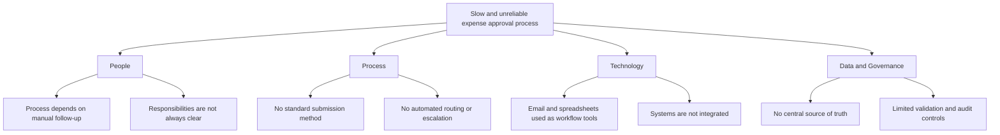

# Pain Point and Root Cause Analysis

## 1. Purpose

This document analyses the problems identified in the current expense approval process and identifies their underlying causes.

The findings will be used to design the future To-Be process and define the system requirements.

> Note: This analysis is based on a fictional portfolio scenario. In a real project, the findings would be validated through stakeholder interviews, workshops, process observation and operational data.

## 2. Pain Point Register

| ID | Pain Point | Business Impact | Impact Level | Evidence to Collect |
|---|---|---|---|---|
| PP-01 | Employees submit incomplete information | Requests must be returned for correction | High | Percentage of returned requests |
| PP-02 | Receipts are missing or stored separately | Finance cannot verify some expenses efficiently | High | Number of requests without receipts |
| PP-03 | Approval requests remain in email inboxes | Employees receive reimbursement late | High | Average approval time |
| PP-04 | Approval routing is performed manually | Requests may be sent to the wrong approver | High | Number of incorrectly routed requests |
| PP-05 | Finance manually re-enters information | Additional work and data-entry errors | High | Processing time and error rate |
| PP-06 | Employees cannot track request status | Employees contact Finance for updates | Medium | Number of status enquiries |
| PP-07 | Records are distributed across emails and spreadsheets | Difficult to produce a complete audit trail | High | Missing approval records |
| PP-08 | Status updates are performed manually | Management information may be outdated | Medium | Difference between actual and recorded status |
| PP-09 | Reporting requires manual preparation | Management receives delayed insights | Medium | Time spent preparing reports |
| PP-10 | There is no automatic reminder or escalation | Overdue requests are not addressed promptly | High | Number of overdue approvals |

## 3. Root Cause Categories

## 4. Root Cause Analysis

| Category | Root Cause | Related Pain Points |
|---|---|---|
| People | Employees may not know all submission requirements | PP-01, PP-02 |
| People | Approvers must remember to review email requests | PP-03, PP-10 |
| People | Responsibilities and escalation routes are unclear | PP-04, PP-10 |
| Process | There is no standardised submission workflow | PP-01, PP-02, PP-07 |
| Process | Approval thresholds are applied manually | PP-04 |
| Process | There is no agreed reminder or escalation process | PP-03, PP-10 |
| Technology | Email is being used as a workflow management tool | PP-03, PP-06, PP-07 |
| Technology | Spreadsheet data must be updated manually | PP-05, PP-08, PP-09 |
| Technology | Submission, approval and reporting tools are not integrated | PP-05, PP-07, PP-09 |
| Data | Required fields are not automatically validated | PP-01 |
| Data | Request records do not have a consistent unique identifier | PP-05, PP-07 |
| Data | Status values may be entered inconsistently | PP-06, PP-08, PP-09 |
| Governance | There is no central audit trail | PP-07 |
| Governance | Approval rules are not embedded in the process | PP-04 |
| Governance | Process performance is not routinely measured | PP-03, PP-09, PP-10 |

## 5. Five Whys Analysis: Approval Delays

### Problem

Expense requests frequently take too long to approve.

| Why | Question and Finding |
|---:|---|
| 1 | Why are expense requests delayed? Because managers do not always review them promptly. |
| 2 | Why do managers not review them promptly? Because requests are mixed with other emails. |
| 3 | Why are requests managed through normal email? Because there is no dedicated approval workflow. |
| 4 | Why is there no dedicated workflow? Because the process developed around spreadsheets and manual communication. |
| 5 | Why has the manual process continued? Because the organisation has not implemented automated routing, reminders or process-performance monitoring. |

### Root Cause

The main cause is the absence of a central workflow with automated routing, reminders, escalation and status monitoring.

## 6. Five Whys Analysis: Incomplete Submissions

### Problem

Finance frequently receives expense requests with missing information or supporting evidence.

| Why | Question and Finding |
|---:|---|
| 1 | Why is information missing? Because employees can send an email without providing every required detail. |
| 2 | Why can they omit required information? Because the spreadsheet and email process does not enforce mandatory fields. |
| 3 | Why are mandatory fields not enforced? Because validation is performed manually. |
| 4 | Why is validation manual? Because the submission method is not connected to a workflow system. |
| 5 | Why is there no connected workflow? Because the current process relies on separate email and spreadsheet tools. |

### Root Cause

The process lacks a standardised submission form with required fields and automatic validation.

## 7. Pain Point Prioritisation

Priority is based on the expected business impact and urgency of the issue.

| Priority | Pain Point | Impact | Urgency | Reason |
|---:|---|---|---|---|
| 1 | Incomplete submissions | High | High | Prevents requests from progressing |
| 2 | Approval delays | High | High | Delays employee reimbursement |
| 3 | Manual approval routing | High | High | Creates control and compliance risks |
| 4 | Manual data entry | High | High | Consumes time and introduces errors |
| 5 | Fragmented audit trail | High | Medium | Makes investigation and reporting difficult |
| 6 | No status visibility | Medium | High | Generates additional employee enquiries |
| 7 | No reminder or escalation | High | Medium | Allows requests to remain overdue |
| 8 | Manual reporting | Medium | Medium | Delays management information |
| 9 | Inconsistent status updates | Medium | Medium | Reduces reporting reliability |

## 8. Improvement Opportunities

| Pain Point | Improvement Opportunity |
|---|---|
| Incomplete submissions | Use an online form with mandatory fields and validation |
| Missing receipts | Require receipt upload according to business rules |
| Approval delays | Send automated notifications and reminders |
| Incorrect routing | Apply automated approval thresholds |
| Manual data entry | Record form submissions directly in a central dataset |
| No status visibility | Maintain standard status values for every request |
| Fragmented audit trail | Record submission, approval and decision timestamps |
| Manual reporting | Use the Excel Desktop dashboard in the current prototype; consider Power BI later if licensing and tenant access are available |
| Overdue approvals | Introduce reminder and escalation rules |

## 9. Conclusion

The analysis indicates that the main problems are not caused by a single individual. They result from a process that depends on email, disconnected spreadsheets and manual follow-up.

The future process should therefore focus on:

- Standardised data collection
- Automatic validation
- Rule-based approval routing
- Automatic notifications and reminders
- Central status tracking
- A complete audit trail
- Reliable management reporting
