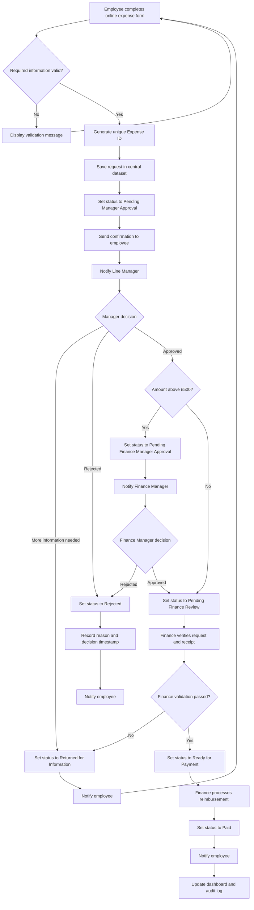

# To-Be Expense Approval Process

## 1. Purpose

This document describes the proposed future expense approval process after automation is introduced.

The To-Be process addresses the pain points identified in the current process by using standardised data collection, automated validation, rule-based approval routing, status tracking and management reporting.

## 2. To-Be Process Objectives

The future process should:

- Capture complete expense information
- Reduce manual data entry
- Route requests to the correct approver
- Provide automatic notifications
- Record approval decisions and timestamps
- Allow request status to be monitored
- Maintain a central audit trail
- Support management reporting
- Protect confidential information

## 3. Future Process Flow

## 4. Detailed To-Be Process

| Step | Activity | Owner | System Action | Resulting Status |
|---:|---|---|---|---|
| 1 | Complete expense form | Employee | Validate required fields | Not submitted |
| 2 | Submit valid request | Employee | Generate Expense ID | Submitted |
| 3 | Store request | System | Add record to central dataset | Submitted |
| 4 | Route request | System | Identify and notify Line Manager | Pending Manager Approval |
| 5 | Review request | Line Manager | Display request information and receipt | Pending Manager Approval |
| 6 | Approve, reject or return request | Line Manager | Record decision and timestamp | Approved, Rejected or Returned |
| 7 | Check expense value | System | Apply approval threshold | Pending Finance Manager Approval where required |
| 8 | Review high-value request | Finance Manager | Record decision and timestamp | Approved or Rejected |
| 9 | Validate approved request | Finance Officer | Check policy and supporting evidence | Pending Finance Review |
| 10 | Confirm request is valid | Finance Officer | Update request status | Ready for Payment |
| 11 | Process reimbursement | Finance Officer | Record payment date | Paid |
| 12 | Notify employee | System | Send decision or payment confirmation | Current status retained |
| 13 | Update reporting | System | Refresh central data and dashboard | Current status retained |
| 14 | Record actions | System | Add user, action and timestamp to audit log | Current status retained |

## 5. Proposed Status Values

| Status | Definition |
|---|---|
| Submitted | The request has been successfully received |
| Pending Manager Approval | The request is waiting for the Line Manager |
| Returned for Information | The employee must correct or provide additional information |
| Pending Finance Manager Approval | A high-value request requires additional approval |
| Pending Finance Review | The request is waiting for Finance validation |
| Ready for Payment | The request has passed all required checks |
| Paid | Reimbursement has been processed |
| Rejected | The request has been declined |
| Cancelled | The employee or authorised user has cancelled the request |

## 6. Automated Controls

The proposed process includes the following controls:

- Mandatory fields
- Valid email format
- Amount must be greater than zero
- Expense date cannot be in the future
- Required receipt based on expense value
- Unique Expense ID
- Rule-based approval routing
- Mandatory rejection reason
- Automatic decision timestamps
- Standard status values
- Automatic employee notifications
- Central audit log
- Restricted access to confidential information

## 7. Notification Events

| Event | Recipient | Notification |
|---|---|---|
| Request submitted | Employee | Submission confirmation and Expense ID |
| Manager review required | Line Manager | Approval request |
| More information required | Employee | Correction request and reason |
| Request rejected | Employee | Rejection notification and reason |
| Additional approval required | Finance Manager | High-value approval request |
| Finance review required | Finance Officer | Approved request ready for validation |
| Request ready for payment | Finance Officer | Payment-processing notification |
| Payment recorded | Employee | Payment confirmation |
| Approval overdue | Approver | Reminder notification |
| Approval significantly overdue | Finance Manager | Escalation notification |

## 8. Pain Point Resolution

| Pain Point | To-Be Solution |
|---|---|
| Incomplete information | Mandatory form fields and validation |
| Missing receipts | Conditional receipt requirement |
| Approval delays | Automatic notifications, reminders and escalation |
| Incorrect approval routing | Rule-based routing |
| Manual data entry | Direct recording in a central dataset |
| No status visibility | Standard request statuses |
| Fragmented audit trail | Central action and decision log |
| Inconsistent status updates | Automated status changes |
| Manual reporting | Dashboard connected to the central dataset |
| Employee status enquiries | Automatic confirmation and status notifications |

## 9. Expected Business Benefits

- Faster approval turnaround
- Fewer incomplete submissions
- Reduced finance administration
- More consistent approval decisions
- Improved status visibility
- Stronger auditability
- More reliable management reporting
- Better employee experience

## 10. Process Boundaries

The prototype ends when Finance records the request as Paid.

The following activities remain outside the project scope:

- Actual bank transfer
- Payroll processing
- Accounting ledger posting
- Tax calculation
- Live ERP integration

## 11. Validation Required

In a real project, the To-Be process would require approval from:

- Line Managers
- Finance Officers
- Finance Manager
- System Administrator
- Data protection or information security representative
- Project Sponsor
