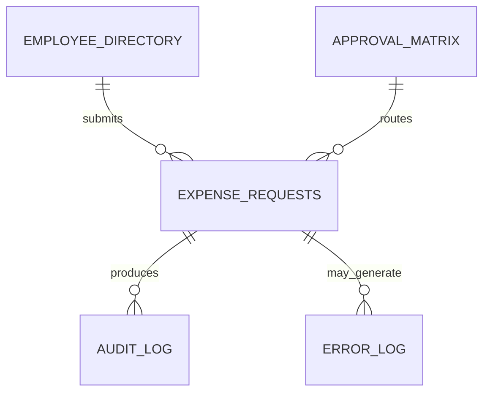

# Data Dictionary

## 1. Purpose

This document defines the datasets, fields, data types, validation rules and example values required for the Invoice and Expense Approval Automation project.

The data model supports:

- Expense submission
- Approval routing
- Finance review
- Status tracking
- Audit logging
- Error monitoring
- SQL and Python analysis
- Excel Desktop dashboard reporting. Power BI reporting is planned as a future enhancement, subject to licensing and tenant access.

All example data used in this project is fictional.

## 2. Data Model Overview

The prototype contains five main datasets:

1. `Expense_Requests`
2. `Employee_Directory`
3. `Approval_Matrix`
4. `Audit_Log`
5. `Error_Log`

## 3. Naming Conventions

- Dataset names use `Title_Case_With_Underscores`
- Field names use `Title_Case_With_Underscores`
- IDs must be unique
- Dates use `YYYY-MM-DD`
- Date and time values use ISO 8601 format
- Currency values contain numbers only
- Boolean fields use `TRUE` or `FALSE`
- Blank and zero must not be treated as the same value
- Email addresses are stored in lowercase where possible

---

# Dataset 1: Expense_Requests

## 4. Purpose

This is the central dataset containing one record for each submitted expense request.

| Field Name | Data Type | Required | Example | Validation or Description |
|---|---|---:|---|---|
| Expense_ID | Text | Yes | EXP-2026-0001 | Unique identifier; must not be duplicated |
| Employee_ID | Text | Yes | EMP-001 | Must exist in Employee_Directory |
| Employee_Name | Text | Yes | Alex Morgan | Fictional name for portfolio data |
| Employee_Email | Text | Yes | alex.morgan@example.com | Must use a valid email format |
| Department | Text | Yes | Finance | Must use an approved department value |
| Line_Manager_Email | Text | Yes | manager@example.com | Retrieved from Employee_Directory |
| Expense_Date | Date | Yes | 2026-09-15 | Cannot be in the future |
| Expense_Category | Text | Yes | Travel | Must use an approved category |
| Amount_GBP | Decimal | Yes | 125.50 | Must be greater than zero |
| Description | Text | Yes | Train travel to client meeting | Plain-language explanation of expense |
| Receipt_Link | Text/URL | Conditional | Private file link | Required when Amount_GBP is above £25 |
| Policy_Exception | Boolean | Yes | FALSE | TRUE when outside standard expense policy |
| Potential_Duplicate | Boolean | Yes | FALSE | Set by duplicate-checking logic |
| Approval_Rule_ID | Text | Yes | RULE-001 | Rule selected from Approval_Matrix |
| Current_Approver_Email | Text | Conditional | manager@example.com | Blank when no approval is outstanding |
| Current_Status | Text | Yes | Pending Manager Approval | Must use an approved status |
| Submitted_At | DateTime | Yes | 2026-09-16T09:30:00Z | Generated automatically |
| Manager_Decision | Text | Conditional | Approved | Approved, Rejected, Returned or Pending |
| Manager_Email | Text | Conditional | manager@example.com | Person who completed the decision |
| Manager_Decision_At | DateTime | Conditional | 2026-09-16T11:15:00Z | Recorded automatically |
| Manager_Comments | Text | No | Approved within policy | Mandatory for rejection or return |
| Finance_Manager_Decision | Text | Conditional | Approved | Required for high-value requests |
| Finance_Manager_Email | Text | Conditional | finance.manager@example.com | Person who completed additional approval |
| Finance_Manager_Decision_At | DateTime | Conditional | 2026-09-16T13:00:00Z | Recorded automatically |
| Finance_Manager_Comments | Text | No | Approved | Mandatory for rejection or return |
| Finance_Review_Result | Text | Conditional | Passed | Pending, Passed, Returned or Rejected |
| Finance_Officer_Email | Text | Conditional | finance.officer@example.com | Finance user completing review |
| Ready_For_Payment_At | DateTime | Conditional | 2026-09-17T10:00:00Z | Recorded when validation passes |
| Payment_Date | Date | Conditional | 2026-09-18 | Required when status is Paid |
| Rejection_Reason | Text | Conditional | Expense outside policy | Mandatory when status is Rejected |
| Return_Reason | Text | Conditional | Receipt is unclear | Mandatory when request is returned |
| Last_Updated_At | DateTime | Yes | 2026-09-18T14:30:00Z | Updated after every workflow action |

## 5. Expense Status Values

Only the following values are permitted:

| Status | Description |
|---|---|
| Submitted | Request has been received |
| Pending Manager Approval | Waiting for Line Manager decision |
| Returned for Information | Employee must provide additional information |
| Pending Finance Manager Approval | Waiting for high-value approval |
| Pending Finance Review | Waiting for Finance validation |
| Ready for Payment | All approvals and checks have passed |
| Paid | Payment has been recorded |
| Rejected | Request has been declined |
| Cancelled | Request has been cancelled |

## 6. Expense Category Values

| Category Code | Category Name |
|---|---|
| TRAVEL | Travel |
| ACCOM | Accommodation |
| MEALS | Meals and Subsistence |
| OFFICE | Office Supplies |
| TRAINING | Training and Professional Development |
| CLIENT | Client Entertainment |
| SOFTWARE | Software and Subscriptions |
| MILEAGE | Mileage |
| OTHER | Other |

If `OTHER` is selected, the Description field must provide sufficient detail.

---

# Dataset 2: Employee_Directory

## 7. Purpose

This dataset identifies employees, departments and Line Managers for routing purposes.

| Field Name | Data Type | Required | Example | Validation or Description |
|---|---|---:|---|---|
| Employee_ID | Text | Yes | EMP-001 | Unique employee identifier |
| Employee_Name | Text | Yes | Alex Morgan | Fictional portfolio name |
| Employee_Email | Text | Yes | alex.morgan@example.com | Must be unique |
| Department | Text | Yes | Finance | Must use an approved department value |
| Line_Manager_ID | Text | Conditional | EMP-010 | Employee ID of Line Manager |
| Line_Manager_Email | Text | Yes | manager@example.com | Used for approval routing |
| Active_Flag | Boolean | Yes | TRUE | Indicates whether the employee is active |
| Effective_From | Date | Yes | 2026-01-01 | Start date of the record |
| Effective_To | Date | No | 2026-12-31 | Blank while the record remains active |

## 8. Department Values

The prototype will use:

- Finance
- Human Resources
- Operations
- Sales
- Marketing
- Information Technology
- Customer Service
- Management

---

# Dataset 3: Approval_Matrix

## 9. Purpose

This dataset stores the approval thresholds and routing rules.

| Field Name | Data Type | Required | Example | Validation or Description |
|---|---|---:|---|---|
| Approval_Rule_ID | Text | Yes | RULE-001 | Unique rule identifier |
| Minimum_Amount_GBP | Decimal | Yes | 0.01 | Inclusive minimum amount |
| Maximum_Amount_GBP | Decimal | Conditional | 500.00 | Blank if no upper limit exists |
| Line_Manager_Required | Boolean | Yes | TRUE | Indicates whether Line Manager approval is required |
| Finance_Manager_Required | Boolean | Yes | FALSE | TRUE for high-value requests |
| Finance_Review_Required | Boolean | Yes | TRUE | Required for all approved requests |
| Policy_Exception_Rule | Boolean | Yes | FALSE | TRUE when rule applies to exceptions |
| Reminder_After_Days | Integer | Yes | 1 | Number of business days before reminder |
| Escalation_After_Days | Integer | Yes | 3 | Number of business days before escalation |
| Active_Flag | Boolean | Yes | TRUE | Only active rules may be used |
| Effective_From | Date | Yes | 2026-01-01 | Rule start date |
| Effective_To | Date | No | 2026-12-31 | Blank when currently active |

## 10. Initial Approval Rules

| Approval_Rule_ID | Minimum | Maximum | Line Manager | Finance Manager | Finance Review |
|---|---:|---:|---:|---:|---:|
| RULE-001 | £0.01 | £500.00 | Yes | No | Yes |
| RULE-002 | £500.01 | No upper limit | Yes | Yes | Yes |
| RULE-003 | Any amount | Policy exception | Yes | Yes | Yes |

---

# Dataset 4: Audit_Log

## 11. Purpose

This dataset stores a chronological record of significant workflow events.

| Field Name | Data Type | Required | Example | Validation or Description |
|---|---|---:|---|---|
| Audit_ID | Text | Yes | AUD-000001 | Unique audit record ID |
| Expense_ID | Text | Yes | EXP-2026-0001 | Must exist in Expense_Requests |
| Action_Type | Text | Yes | Manager Approved | Standard action value |
| Previous_Status | Text | Conditional | Pending Manager Approval | Status before the action |
| New_Status | Text | Yes | Pending Finance Review | Status after the action |
| Action_By | Text | Yes | manager@example.com | User or system performing action |
| Action_At | DateTime | Yes | 2026-09-16T11:15:00Z | Automatic timestamp |
| Comments | Text | No | Approved within policy | Required for rejection or return |
| Automation_Run_ID | Text | No | RUN-12345 | Identifier supplied by automation platform |

## 12. Audit Action Values

Examples include:

- Request Submitted
- Manager Approved
- Manager Rejected
- Request Returned
- Request Resubmitted
- Finance Manager Approved
- Finance Manager Rejected
- Finance Review Passed
- Finance Review Failed
- Status Changed
- Reminder Sent
- Request Escalated
- Payment Recorded
- Request Cancelled

Audit records should be appended and should not overwrite previous events.

---

# Dataset 5: Error_Log

## 13. Purpose

This dataset records automation and data-processing errors for investigation.

| Field Name | Data Type | Required | Example | Validation or Description |
|---|---|---:|---|---|
| Error_ID | Text | Yes | ERR-000001 | Unique error identifier |
| Expense_ID | Text | No | EXP-2026-0001 | Blank if failure occurred before ID creation |
| Workflow_Step | Text | Yes | Send confirmation email | Stage where failure occurred |
| Error_Type | Text | Yes | Notification Failure | Standard error category |
| Error_Message | Text | Yes | Email could not be delivered | Must not expose passwords or tokens |
| Occurred_At | DateTime | Yes | 2026-09-16T09:31:00Z | Automatic timestamp |
| Resolved_Flag | Boolean | Yes | FALSE | Indicates whether issue is resolved |
| Resolved_By | Text | No | admin@example.com | Required after resolution |
| Resolved_At | DateTime | No | 2026-09-16T10:00:00Z | Required after resolution |
| Resolution_Notes | Text | No | Email address corrected | Description of resolution |

## 14. Error Type Values

- Validation Failure
- Data Write Failure
- Approval Routing Failure
- Notification Failure
- File Access Failure
- Dashboard Refresh Failure
- Unknown Automation Failure

## 15. Primary and Foreign Keys

| Dataset | Primary Key | Foreign Keys |
|---|---|---|
| Expense_Requests | Expense_ID | Employee_ID, Approval_Rule_ID |
| Employee_Directory | Employee_ID | Line_Manager_ID |
| Approval_Matrix | Approval_Rule_ID | None |
| Audit_Log | Audit_ID | Expense_ID |
| Error_Log | Error_ID | Expense_ID where available |

## 16. Data Quality Rules

| Rule ID | Data Quality Rule |
|---|---|
| DQ-001 | Expense_ID must be unique |
| DQ-002 | Employee_ID must exist in Employee_Directory |
| DQ-003 | Amount_GBP must be numeric and greater than zero |
| DQ-004 | Expense_Date cannot be in the future |
| DQ-005 | Current_Status must use an approved status |
| DQ-006 | Expense_Category must use an approved category |
| DQ-007 | Receipt_Link is required when Amount_GBP exceeds £25 |
| DQ-008 | Rejection_Reason is required when status is Rejected |
| DQ-009 | Payment_Date is required when status is Paid |
| DQ-010 | Manager and Finance decisions must include timestamps |
| DQ-011 | Public datasets must contain only fictional data |
| DQ-012 | Audit records must not be overwritten |

## 17. Data Classification

| Data Element | Classification | Public GitHub Treatment |
|---|---|---|
| Fictional sample expenses | Public | May be uploaded |
| Real employee details | Confidential | Must not be uploaded |
| Receipt files | Private | Do not upload |
| Receipt links | Private | Replace with fictional placeholders |
| API keys and access tokens | Secret | Must never be uploaded |
| Approval emails | Personal | Use fictional addresses |
| Aggregated dashboard results | Public if fictional | May be uploaded |
| Audit logs | Public only if fictional | Remove sensitive technical details |

## 18. Data Storage

| Data | Current or publication treatment |
|---|---|
| Synthetic sample data | Publish only if fully fictional and intentionally included in the repository |
| Live working spreadsheet | Keep in private OneDrive for Business; never commit |
| Receipt files and links | Keep in private storage; never commit |
| Excel dashboard screenshots | Publish only after confirming they show synthetic data and no personal or account details; none are included currently |
| API keys and tokens | Never commit; store in a password manager or protected environment variables |
| Audit and error logs | Keep live logs private; publish only fictional or sanitised examples |
